[ISB Presentation Draft](https://docs.google.com/presentation/d/1VL710cWRl3M_wp_CHAw9tNoZ5ufOJEE1scFNnFHnCTk/edit?usp=sharing)

```{r setup, include=FALSE}
knitr::opts_chunk$set(echo = TRUE)
library(afex)
library(emmeans)
library(kableExtra)
library(dplyr)
library(tidyverse)
library(afex)
library(emmeans)
library(remotes)
library(eegUtils)
```

#F0 136 to 280 ms 
```{r}
# Load data
ERP_F0_long <- readr::read_csv("tidy_data_all_erps/ERP_F0_long.csv")

# Create subject ID 
ERP_F0_long <- ERP_F0_long %>%
  mutate(Subject_ID = paste(Participant_ID, L1_L2, sep = "_"))

# Filter 
f0_136_data <- ERP_F0_long %>%
  filter(time_period == "136_280",
         channel %in% c("F3", "FZ", "FC1", "CZ"))

# Repeated-measures ANOVA
aov_pran_136 <- aov_ez(
  id = "Subject_ID",
  dv = "amplitude",
  within = c("stress", "match"),
  between = "L1_L2",
  data = f0_136_data,
  type = 3
)

# ANOVA summary
summary(aov_pran_136)

# Estimated marginal means
em <- emmeans(aov_pran_136, ~ stress * match * L1_L2)
kable(as.data.frame(em), digits = 2)

knitr::kable(nice(aov_pran_136), caption = "F0 136–280 ms Repeated Measures ANOVA") %>%
  kable_styling(full_width = FALSE)
```

#F0 280-400 ms
```{r}
# Filter
f0_280_data <- ERP_F0_long %>%
  filter(time_period == "280_400",
         channel %in% c("F3", "FZ", "FC1", "CZ"))

# Repeated-measures ANOVA
aov_pran_280 <- aov_ez(
  id = "Subject_ID",
  dv = "amplitude",
  within = c("stress", "match"),
  between = "L1_L2",
  data = f0_280_data,
  type = 3,
  return = "afex_aov"
)

# ANOVA summary
summary(aov_pran_280)

# Estimated marginal means
emmeans(aov_pran_280, ~ stress * match * L1_L2)

knitr::kable(nice(aov_pran_280), caption = "F0 280–400 ms Repeated Measures ANOVA") %>%
  kable_styling(full_width = FALSE)
```

# F0 400 to 600 ms 
```{r}
# Filter
f0_400_data <- ERP_F0_long %>%
  filter(time_period == "400_600",
         channel %in% c("F3", "FZ", "FC1", "CZ")) 

# Repeated-measures ANOVA
aov_pran_400 <- aov_ez(
  id = "Subject_ID",
  dv = "amplitude",
  within = c("stress", "match"),
  between = "L1_L2",
  data = f0_400_data,
  type = 3,
  return = "afex_aov"
)

# ANOVA summary
summary(aov_pran_400)

# Estimated marginal means
emmeans(aov_pran_400, ~ stress * match * L1_L2)

knitr::kable(nice(aov_pran_400), caption = "F0 400–600 ms Repeated Measures ANOVA") %>%
  kable_styling(full_width = FALSE)

```

# Suffix 235 to 415 ms 
```{r}
ERP_suffix_long <- readr::read_csv("tidy_data_all_erps/ERP_suffix_long.csv")

ERP_suffix_long <- ERP_suffix_long %>%
  mutate(Subject_ID = paste(Participant_ID, L1_L2, sep = "_"))

# 235–415 ms
suffix_235_data <- ERP_suffix_long %>%
  filter(time_period == "235_415",
         channel %in% c("F7", "F3", "FC5"))

aov_suffix_235 <- aov_ez(
  id = "Subject_ID",
  dv = "amplitude",
  within = c("stress", "match"),
  between = "L1_L2",
  data = suffix_235_data,
  type = 3,
  return = "afex_aov"
)

# View summary
summary(aov_suffix_235)

# Post-hoc comparisons
emmeans(aov_suffix_235, ~ stress * match * L1_L2)

knitr::kable(nice(aov_suffix_235), caption = "Suffix 235–415 ms Repeated Measures ANOVA") %>%
  kable_styling(full_width = FALSE)
```

# Suffix 415-550 ms
```{r}
suffix_415_data <- ERP_suffix_long %>%
  filter(time_period == "415_550",
         channel %in% c("F7", "F3", "FC5"))

aov_suffix_415 <- aov_ez(
  id = "Subject_ID",
  dv = "amplitude",
  within = c("stress", "match"),
  between = "L1_L2",
  data = suffix_415_data,
  type = 3,
  return = "afex_aov"
)

summary(aov_suffix_415)
emmeans(aov_suffix_415, ~ stress * match * L1_L2)

knitr::kable(nice(aov_suffix_415), caption = "Suffix 415–550 ms Repeated Measures ANOVA") %>%
  kable_styling(full_width = FALSE)
```

# Suffix 550-680 ms 
```{r}
suffix_550_data <- ERP_suffix_long %>%
  filter(time_period == "550_680",
         channel %in% c("F7", "F3", "FC5"))

aov_suffix_550 <- aov_ez(
  id = "Subject_ID",
  dv = "amplitude",
  within = c("stress", "match"),
  between = "L1_L2",
  data = suffix_550_data,
  type = 3,
  return = "afex_aov"
)

summary(aov_suffix_550)
emmeans(aov_suffix_550, ~ stress * match * L1_L2)

knitr::kable(nice(aov_suffix_550), caption = "Suffix 550–680 ms Repeated Measures ANOVA") %>%
  kable_styling(full_width = FALSE)
```

# Suffix 680-800 ms 
```{r}
suffix_680_data <- ERP_suffix_long %>%
  filter(time_period == "680_800",
         channel %in% c("F7", "F3", "FC5"))

aov_suffix_680 <- aov_ez(
  id = "Subject_ID",
  dv = "amplitude",
  within = c("stress", "match"),
  between = "L1_L2",
  data = suffix_680_data,
  type = 3,
  return = "afex_aov"
)

# Summary of ANOVA
summary(aov_suffix_680)

# Estimated marginal means
emmeans(aov_suffix_680, ~ stress * match * L1_L2)

knitr::kable(nice(aov_suffix_680), caption = "Suffix 680–800 ms Repeated Measures ANOVA") %>%
  kable_styling(full_width = FALSE)
```

# Topographic plots
## Topographical maps show the difference in mean ERP amplitude between stressed and unstressed conditions at F0 onset (electrodes: F3, Fz, FC1, Cz) and between mismatch and match conditions at suffix onset (electrodes: F7, F3, FC5) across time windows and groups (L1 vs. L2).Gray regions reflect areas outside the interpolation range based on selected electrodes. 
```{r}

f0_diff <- ERP_F0_long %>%
  filter(channel %in% c("F3", "Fz", "FC1", "Cz"),
         time_period %in% c("136_280", "280_400", "400_600")) %>%
  group_by(channel, L1_L2, stress, time_period) %>%
  summarise(mean_amp = mean(amplitude), .groups = "drop") %>%
  pivot_wider(names_from = stress, values_from = mean_amp) %>%
  mutate(diff = stressed - unstressed)

electrode_coords <- tibble::tribble(
  ~electrode, ~x,   ~y,
  "F3",       -0.4,  0.5,
  "Fz",        0.0,  0.7,
  "FC1",       0.3,  0.4,
  "Cz",        0.0,  0.0
)

f0_diff_coords <- f0_diff %>%
  rename(electrode = channel) %>%
  left_join(electrode_coords, by = "electrode")

ggplot(f0_diff_coords, aes(x = x, y = y, fill = diff, z = diff)) +
  geom_topo(interp_limit = "head", chan_markers = "point", colour = "black") +
  scale_fill_distiller(palette = "RdBu", limits = c(-5, 5)) +
  coord_equal() +
  theme_void() +
  facet_grid(L1_L2 ~ time_period) +
  labs(
    title = "Stressed – Unstressed at F0 Onset",
    fill = expression(Delta~Amplitude~(mu*V))
  )

# Optional: View just L2 values
f0_diff_coords %>%
  filter(L1_L2 == "L2") %>%
  select(electrode, time_period, diff)

# Optional: Confirm counts
ERP_F0_long %>%
  filter(channel %in% c("F3", "Fz", "FC1", "Cz"),
         time_period %in% c("136_280", "280_400", "400_600"),
         L1_L2 == "L2") %>%
  count(channel, time_period)

# ==== SUFFIX ANALYSIS ====
suffix_diff <- ERP_suffix_long %>%
  filter(channel %in% c("F7", "F3", "FC5"),
         time_period %in% c("235_415", "415_550", "550_680", "680_800")) %>%
  group_by(channel, L1_L2, match, time_period) %>%
  summarise(mean_amp = mean(amplitude), .groups = "drop") %>%
  pivot_wider(names_from = match, values_from = mean_amp) %>%
  mutate(diff = mismatch - match)

electrode_coords_suffix <- tibble::tribble(
  ~electrode, ~x,   ~y,
  "F7",       -0.7,  0.3,
  "F3",       -0.4,  0.5,
  "FC5",      -0.5,  0.4
)

suffix_diff_coords <- suffix_diff %>%
  rename(electrode = channel) %>%
  left_join(electrode_coords_suffix, by = "electrode")

ggplot(suffix_diff_coords, aes(x = x, y = y, fill = diff, z = diff)) +
  geom_topo(interp_limit = "head", chan_markers = "point", colour = "black") +
  scale_fill_distiller(palette = "RdBu", limits = c(-5, 5)) +
  coord_equal() +
  theme_void() +
  facet_grid(L1_L2 ~ time_period) +
  labs(
    title = "Mismatch – Match at Suffix Onset",
    fill = expression(Delta~Amplitude~(mu*V))
  )

# Optional: View just L2 values
suffix_diff_coords %>%
  filter(L1_L2 == "L2") %>%
  select(electrode, time_period, diff)

# Optional: Confirm counts
ERP_suffix_long %>%
  filter(channel %in% c("F7", "F3", "FC5"),
         time_period %in% c("235_415", "415_550", "550_680", "680_800"),
         L1_L2 == "L2") %>%
  count(channel, time_period)

```

# Summary

###
ERP analyses were conducted across six time windows, three time-locked to the onset of the first syllable of the target word (F0) and three time-locked to the onset of the suffix. For the F0 analyses, epochs were extracted for the 136–280 ms, 280–400 ms, and 400–600 ms windows over fronto-central electrodes: F3, Fz, FC1, and Cz. For the suffix analyses, epochs were extracted for the 235–415 ms, 415–550 ms, 550–680 ms, and 680–800 ms windows over left-frontal electrodes: F7, F3, and FC5.

For the F0 analysis, in the 136–280 ms time window, a significant group × stress × match interaction was observed, F(1, 29) = 4.68, p = .039. In the 280–400 ms time window, a significant group × stress × match interaction was again observed, F(1, 29) = 4.88, p = .035. In the 400–600 ms time window, a significant stress × match interaction was found, F(1, 29) = 4.96, p = .034, along with a significant group × stress × match interaction, F(1, 29) = 4.89, p = .035.

Estimated marginal means showed a consistent pattern across all three time windows: in the L1 group, match trials elicited more positive amplitudes when the verb was stressed than when it was unstressed, while mismatch trials were negative regardless of stress. The L2 group showed consistently negative amplitudes across all conditions. 

For the suffix analysis, no significant effects were found in the 235–415 ms, 415–550 ms, or 550–680 ms time windows. In the 680–800 ms time window, a significant group × stress × match interaction was observed, F(1, 29) = 4.22, p = .049.

Estimated marginal means showed that, in the L1 group, match trials elicited more positive amplitudes when the verb was stressed than when it was unstressed. In mismatch trials, amplitudes were generally negative regardless of stress. The L2 group showed small negative amplitudes across all conditions 

Topographic maps illustrate the scalp distribution of the ERP effects observed in the statistical analyses. 

For the F0 analysis (stressed – unstressed), L1 participants showed a broad fronto-central positivity for stressed forms relative to unstressed forms across all three time windows (136–600 ms), while L2 participants showed minimal differences and weak negative shifts over central sites. 

For the suffix analysis (mismatch – match), L1 participants exhibited a left-frontal positivity for mismatching suffixes in the 550–800 ms windows, with the effect most pronounced in the final window (680–800 ms). In contrast, L2 participants showed a widespread positivity for mismatching suffixes beginning earlier and persisting across all time windows, without clear lateralization.

# Time series plots

```{r}
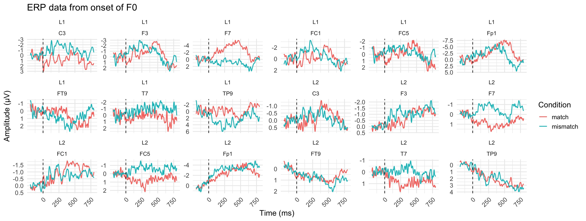
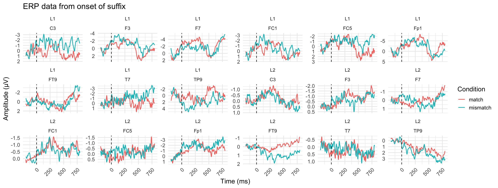
```
# Topographic maps 
```{r}
# PrAN – F0 (136–280 ms)
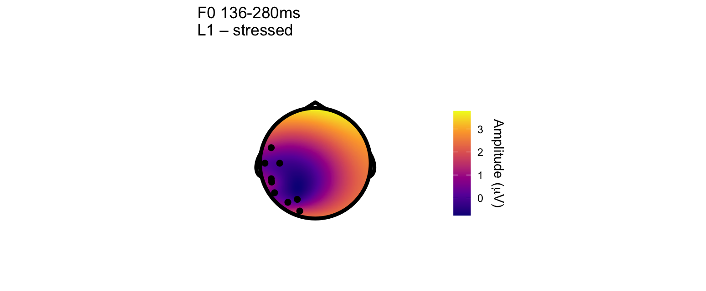
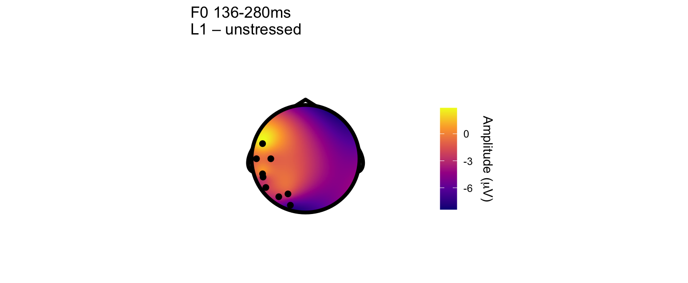

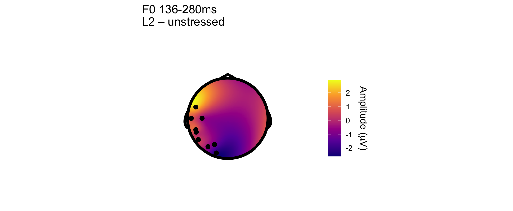

# LAN – Suffix (225–400 ms)
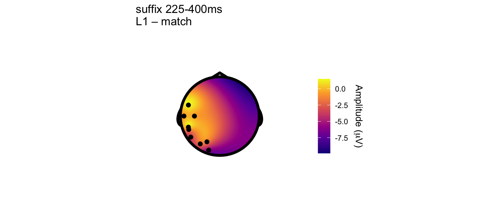

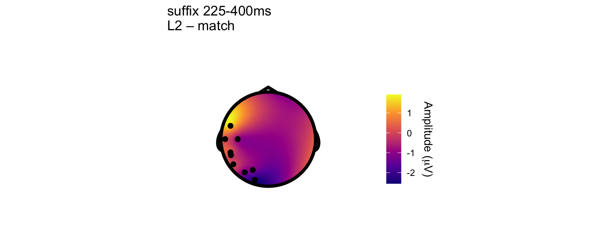
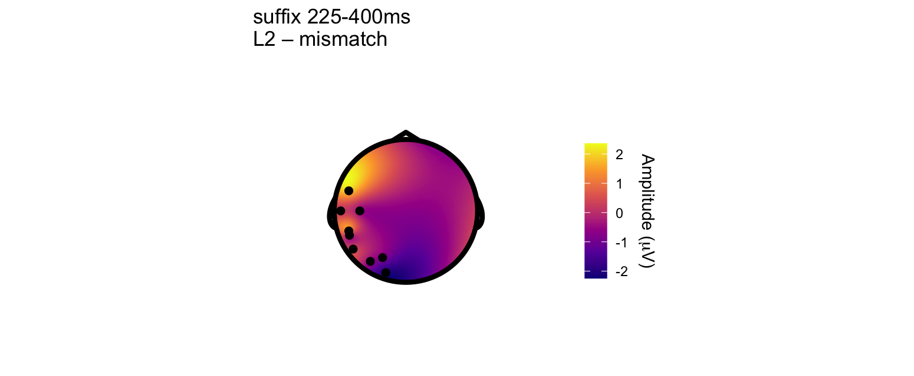

# P600 – Suffix (500–800 ms)
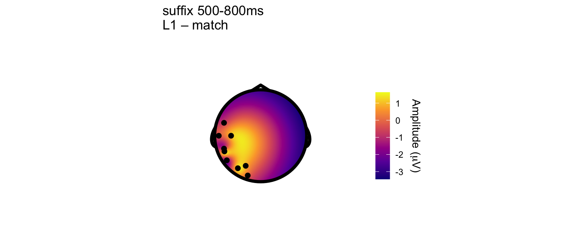
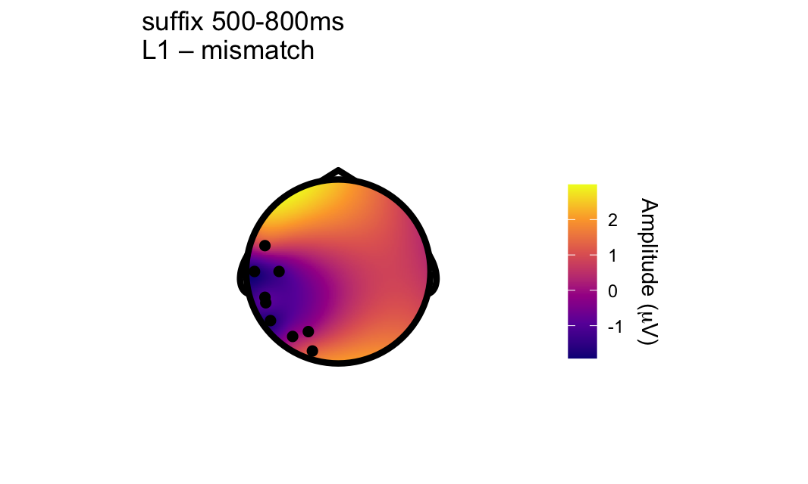
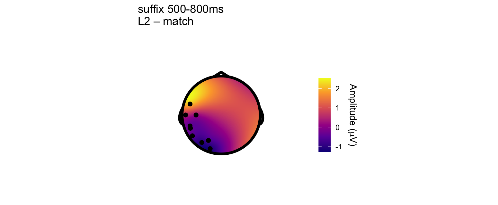
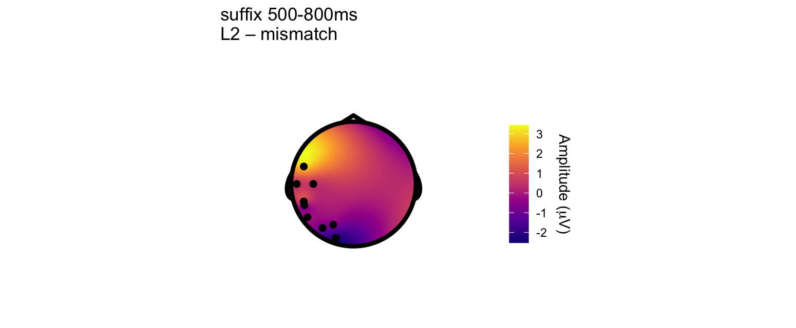

```

# ERP Components

###
The Pre-activation Negativity (PrAN) is a negative-going ERP component that typically arises between 136–280 ms after the onset of a predictive cue (e.g., the first syllable or tone) and is most pronounced at left-frontal scalp sites. PrAN has been interpreted as an index of form-based lexical prediction, reflecting neural pre-activation of likely continuations based on initial auditory input. The amplitude of PrAN increases when there are fewer possible continuations, indicating higher predictive certainty. This component was first identified in Swedish, where native speakers use lexical tone (word accents) to predict upcoming morphosyntactic suffixes. For example, accent 1 cues suffixes like -en (singular definite) and -er (present tense), while accent 2 cues -ar (plural) or -de (past tense). PrAN is stronger following accent 1, as it is associated with fewer possible suffixes and thus greater predictive certainty.

The Left Anterior Negativity (LAN) is an ERP component typically observed between 225–400 ms after stimulus onset, characterized by a negative deflection over left-frontal scalp regions. It has been associated with morphosyntactic processing, such as subject-verb agreement and grammatical gender violations (Osterhout & Mobley, 1995; Friederici, 2002). 


The P600 is a positive-going ERP component that typically emerges between 500–800 ms after the onset of a critical stimulus, often maximal over posterior parietal regions. It has been widely interpreted as reflecting syntactic reanalysis, morphosyntactic repair, or the integration of unpredicted or ungrammatical elements into the ongoing sentence structure (Osterhout & Holcomb, 1992; Hagoort et al., 1993). The amplitude of the P600 increases in response to unexpected or incongruent morphosyntactic cues, such as violations in subject-verb agreement, case marking, or tense morphology.P600 effects have also been observed in response to violations of lexical tone-suffix associations in Swedish, where suffixes that mismatched the tonal expectations of the stem (e.g., accent 1 followed by an accent 2-associated suffix) elicited a robust P600 (Roll et al., 2013; Söderström et al., 2017). These findings suggest that the P600 reflects not only syntactic but also form-based morphophonological prediction errors, particularly when the listener has strong expectations about suffixes based on prosodic cues.


